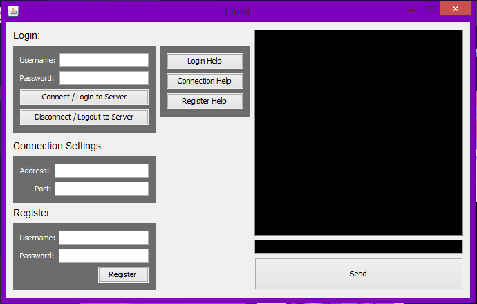
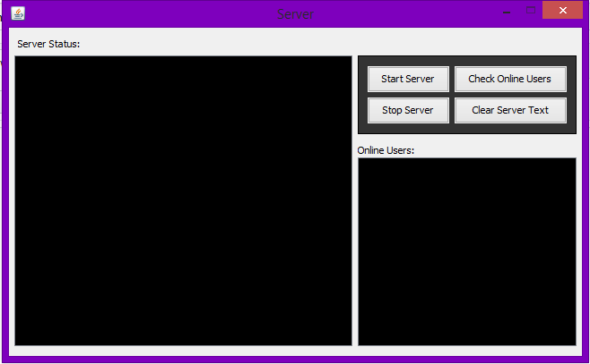

# Chat Application
Chat Application written in Java

**MEMBERS:**
- Sean Baang ([Twitter](http://twitter.com/SeanBaang), [Facebook](http://facebook.com/m0L3cuL3))
- Jose Gonzaga
- Neil Abad
- Michael Yu

## Interfaces

 

### References

Socket Programming References:
- https://www.geeksforgeeks.org/socket-programming-in-java/
- https://www.tutorialspoint.com/java/java_networking.htm

Threading/MultiThreading References:
- https://www.tutorialspoint.com/java/java_multithreading.htm
- https://docs.oracle.com/javase/tutorial/essential/concurrency/runthread.html
- https://www.geeksforgeeks.org/multithreading-in-java/

ArrayList References:
- https://www.tutorialspoint.com/java/java_arraylist_class.htm
- https://www.geeksforgeeks.org/arraylist-in-java/

BufferedReader References:
- https://www.javatpoint.com/java-bufferedreader-class
- https://www.geeksforgeeks.org/java-io-bufferedreader-class-java/
- https://www.tutorialspoint.com/java/io/java_io_bufferedreader.htm

PrintWriter References:
- https://www.geeksforgeeks.org/java-io-printwriter-class-java-set-1/
- https://www.tutorialspoint.com/java/io/java_io_printwriter.htm
- https://www.javatpoint.com/java-printwriter-class

FileWriter References:
- https://www.tutorialspoint.com/java/java_filewriter_class.htm
- https://www.javatpoint.com/java-filewriter-class
- https://www.geeksforgeeks.org/file-handling-java-using-filewriter-filereader/

ClientHandler Class References:
- https://www.geeksforgeeks.org/introducing-threads-socket-programming-java/

InputStreamReader References:
- https://www.tutorialspoint.com/java/io/java_io_inputstreamreader.htm
- https://www.geeksforgeeks.org/java-io-inputstreamreader-class/

Iterator References:
- https://www.geeksforgeeks.org/how-to-use-iterator-in-java/
- https://www.geeksforgeeks.org/iterators-in-java/
- https://www.tutorialspoint.com/java/java_using_iterator.htm

